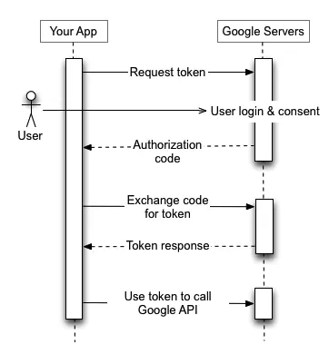

How does OAuth work?
Setting up an OAuth integration for the first time can be a little confusing. Luckily, most OAuth integrations, including Google, follow the same flow:
1. Provide the user with a link to the authentication system that includes what data you’d like the user to give your application access to (scopes), your client ID, and a redirect URL;
2. When the user clicks the link and grants access to your application, they will be redirected back to your application with a security code in the query string;
3. The security code is sent to your application’s server;
4. Your application’s server uses the security code, client ID, and client secret to request an access token & bearer token;
5. The access token and bearer token are used to fetch the user’s profile information on their behalf;
6. The profile information can be used to either verify them against an existing user in your system or create a new user;
7. You finally issue the user a token that will work with your authentication system, probably a JWT.

